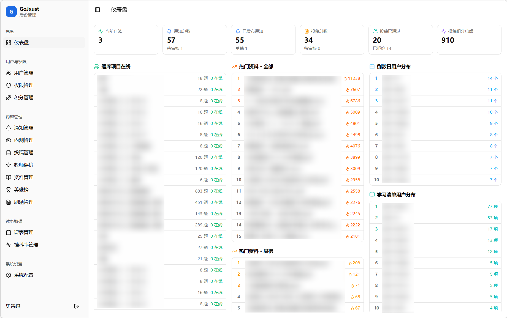
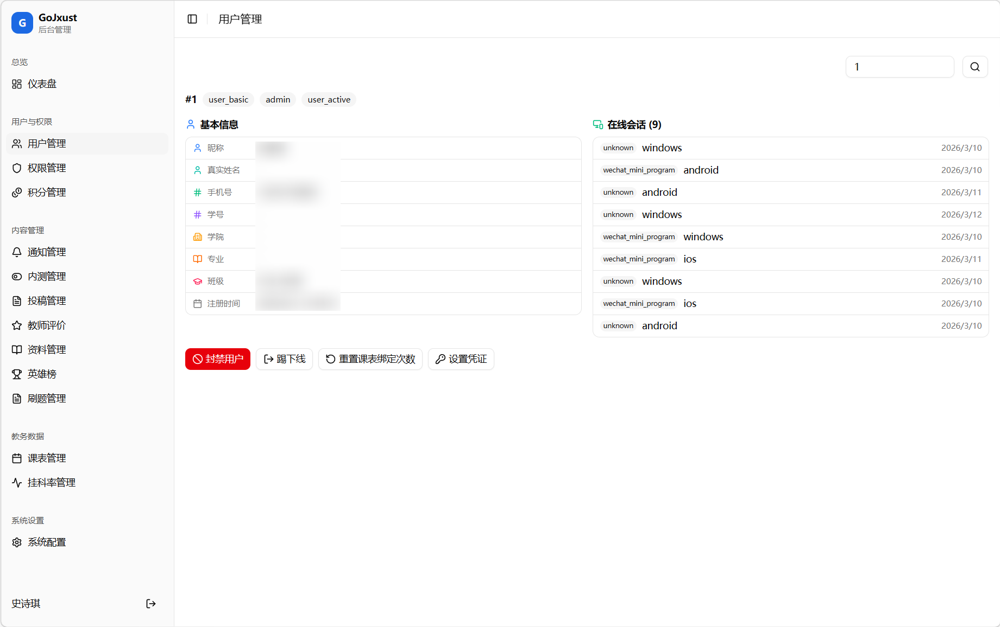
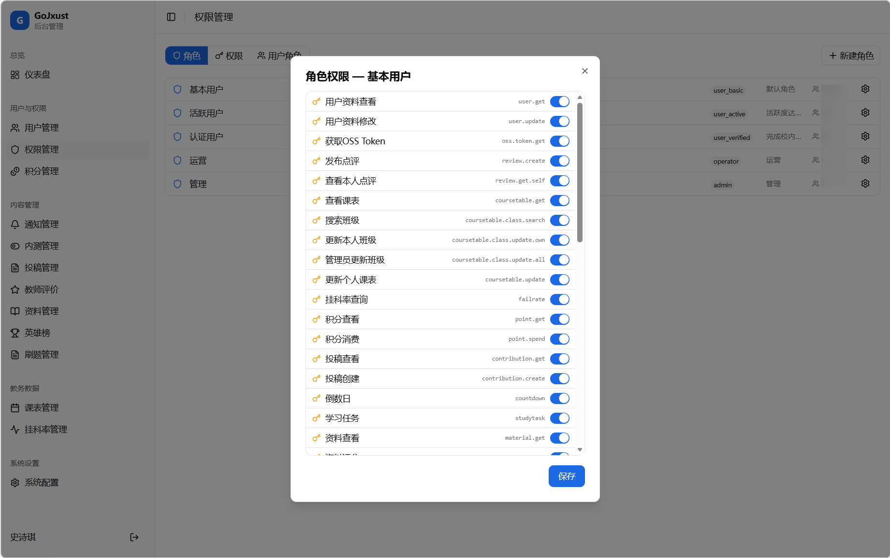
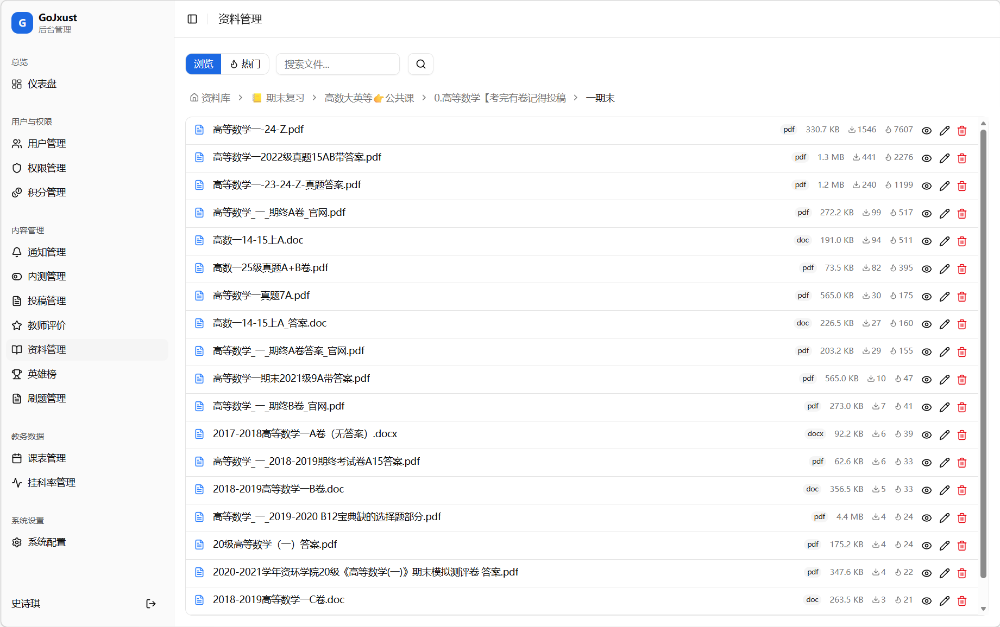
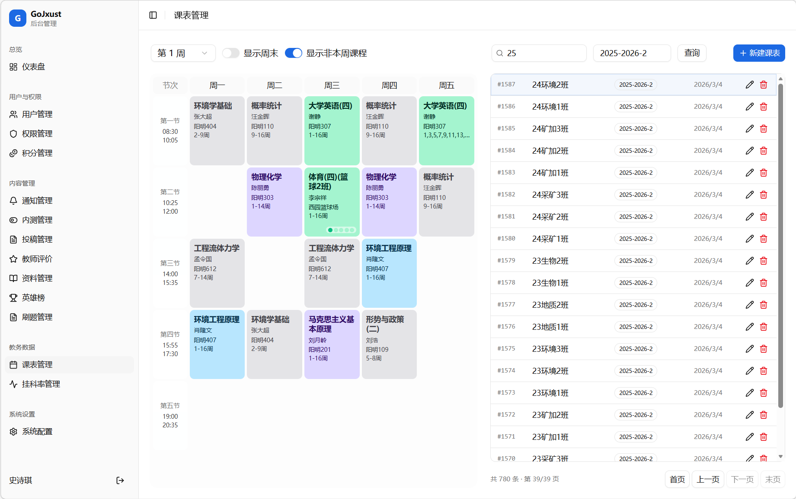
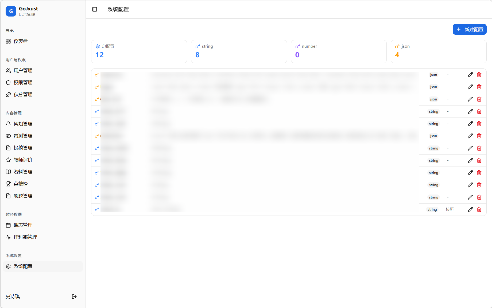

# GoJxust 后台管理前端


GoJxust 后台管理系统前端项目，面向管理员提供用户、权限、通知、资料、投稿、教师评价、积分、课表、题库、不及格率等后台运营能力。

项目基于 Vite + React + TypeScript 构建，使用 React Router 进行路由管理，React Query 处理服务端数据请求，Axios 统一封装接口访问，Zustand 管理登录态。

## 项目特性

- 基于 React 19、TypeScript 5、Vite 7 的现代前端工程。
- 使用 React Router 构建登录页与后台主布局。
- 使用 React Query 管理查询、缓存、刷新与异步状态。
- Axios 统一处理 API 基础地址、请求头注入、401 刷新令牌和错误解包。
- Zustand 持久化管理员登录态、用户信息与令牌信息。
- 后台导航按业务域划分，便于持续扩展管理模块。
- 高信息密度仪表盘设计、各项信息列表可视化展示。
- 适配移动端使用，长信息横向滚动保证体验一致。

## 技术栈

- React 19
- TypeScript
- Vite
- React Router
- TanStack React Query
- Axios
- Zustand
- Tailwind CSS v4
- Radix UI / 自定义基础组件
- Sonner

## 功能模块

当前路由和页面模块包括：

- 登录认证
- 仪表盘总览
- 用户管理
- 权限管理
- 积分管理
- 通知管理
- 内测管理
- 投稿管理
- 教师评价
- 资料管理
- 英雄榜管理
- 刷题管理
- 课表管理
- 挂科率管理
- 系统配置

其中仪表盘已聚合多类数据指标与排行信息，例如：

- 系统在线人数
- 通知与投稿统计
- 题库项目在线情况
- 番茄钟排行
- 热门资料与热搜词
- 倒数日、学习清单、GPA 备份等用户分布数据

## 项目截图

<details>
<summary>总览截图</summary>

| 页面 | 预览 |
| --- | --- |
| 仪表盘 |  |

</details>

<details>
<summary>用户与权限截图</summary>

| 页面 | 预览 |
| --- | --- |
| 用户管理 |  |
| 权限管理 |  |

</details>

<details>
<summary>内容管理截图</summary>

| 页面 | 预览 |
| --- | --- |
| 内容管理 |  |

</details>

<details>
<summary>教务数据截图</summary>

| 页面 | 预览 |
| --- | --- |
| 教务数据 |  |

</details>

<details>
<summary>系统设置截图</summary>

| 页面 | 预览 |
| --- | --- |
| 系统配置 |  |

</details>

## 快速开始

### 1. 安装依赖

项目使用 pnpm 管理依赖：

```bash
pnpm install
```

### 2. 启动开发环境

```bash
pnpm dev
```

默认会启动 Vite 本地开发服务器。

### 3. 生产构建

```bash
pnpm build
```

### 4. 本地预览构建结果

```bash
pnpm preview
```

### 5. 代码检查

```bash
pnpm lint
```

## 环境要求

- Node.js 18 及以上
- pnpm 8 及以上

## 环境变量

项目当前会优先读取 `VITE_API_BASE_URL`，用于拼接后台接口地址。

Axios 客户端会自动把它规范化为以下形式之一：

- 如果你传入的是完整版本化接口前缀，例如 `/api/v0`，则直接使用。
- 如果你传入的是站点根地址，则会自动补成 `/api/v0`。

推荐在项目根目录创建 `.env.local`：

```env
VITE_API_BASE_URL=https://your-domain.com
```

如果后端已经带版本号，也可以直接写：

```env
VITE_API_BASE_URL=https://your-domain.com/api/v0
```

## 登录与鉴权说明

- 登录成功后，前端会把 `token`、`refresh_token` 和用户信息写入本地存储。
- 请求发出时会自动注入 `Authorization: Bearer <token>`。
- 当接口返回 401 时，前端会尝试使用 `refresh_token` 刷新令牌。
- 如果刷新失败，会清理本地登录态并跳转回登录页。

## 常用脚本

```bash
pnpm dev      # 启动开发服务器
pnpm build    # TypeScript 编译并构建生产包
pnpm preview  # 预览构建产物
pnpm lint     # 执行 ESLint 检查
```

## 目录结构

```text
.
├─ public/
├─ src/
│  ├─ api/                # 后台接口封装
│  ├─ assets/             # 静态资源
│  ├─ components/         # 布局组件与基础 UI 组件
│  ├─ hooks/              # 业务 Hook，如登录态、移动端判断
│  ├─ lib/                # 通用工具函数
│  ├─ pages/              # 页面级模块
│  ├─ types/              # 接口与业务类型定义
│  ├─ App.tsx
│  ├─ main.tsx
│  └─ router.tsx          # 路由入口
├─ components.json
├─ eslint.config.js
├─ index.html
├─ package.json
├─ tsconfig.json
└─ vite.config.ts
```

## 开发说明

- 路径别名 `@` 指向 `src/`。
- 页面按业务域拆分在 `src/pages/` 下，接口请求集中在 `src/api/`。
- 后台主框架使用统一侧边栏布局，页面新增时建议同时补充路由与导航配置。
- 如果新增后台模块，建议同步维护本 README 的“功能模块”和“项目截图”部分。
